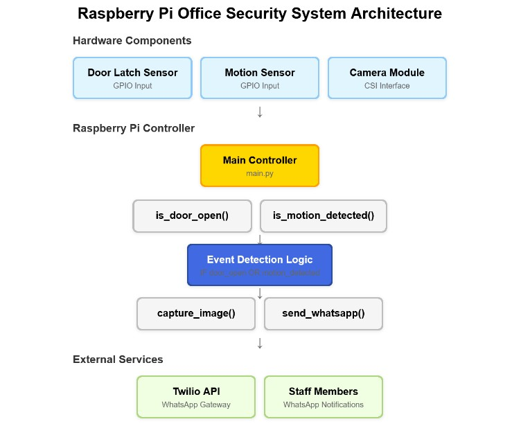
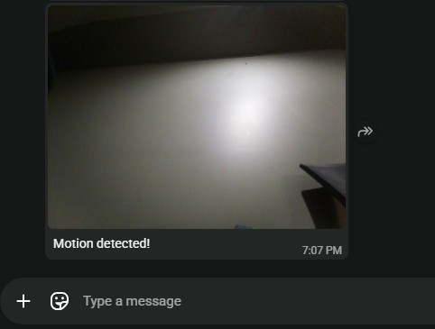

# Raspberry Pi–Based Office Security System

## Background
This project aims to provide low-cost, low-maintenance situational awareness for a small office environment.
The goal is to build a simple, customizable security solution that avoids the complexity and cost of commercial off-the-shelf systems while meeting basic monitoring needs.
The system is designed to detect potential unauthorized entry and notify staff in real time, including capturing an image of the office when an event occurs.

## Intended Users
All department employees.

## Tech Stack

**Hardware:** 
- Raspberry Pi
- CSI Camera Module
- Motion Sensor (GPIO)
- Door Latch Sensor (GPIO)

**Software:**
- Python
- Raspberry Pi OS
- gpiozero (GPIO handling)
- rpicam (image capture)
- requests / twilio-python (HTTP + WhatsApp messaging)

**Cloud & Integrations:**
- Supabase Storage
  - Stores captured images
  - Provides public URLs for images
- Twilio API
  - Provides public URLs for images
  - Sends WhatsApp notifications

## System Logic / Workflow

The Raspberry Pi acts as the central controller and evaluates sensor input based on the following logic:
```
IF door latch sensor == OPEN
OR motion sensor == TRUE
THEN
    capture image
    send WhatsApp notification via Twilio
```

## Architecture diagram


## Screenshot
- Sample notification screenshot


## Notes
This project prioritizes simplicity, reliability, and maintainability over advanced features.

Future enhancements (e.g., door unlock integration, logging, or cloud dashboards) can be added incrementally if needed.

Also consider connecting RPi to cloud platforms (AWS IoT Greengrass, Azure IoT Edge, Google Edge TPU) to build hybrid edge-cloud systems.
